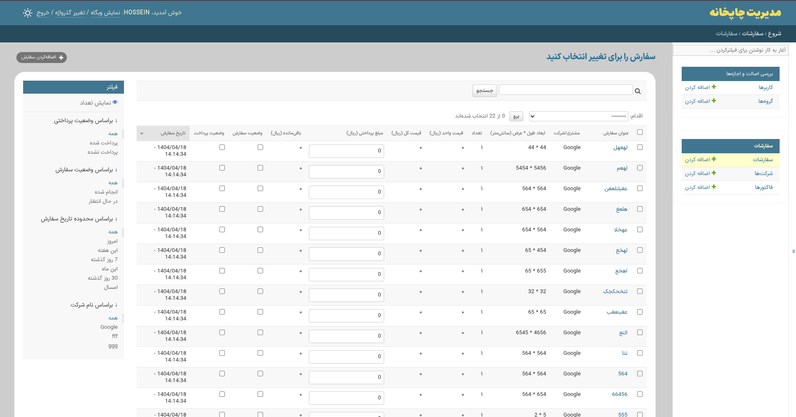
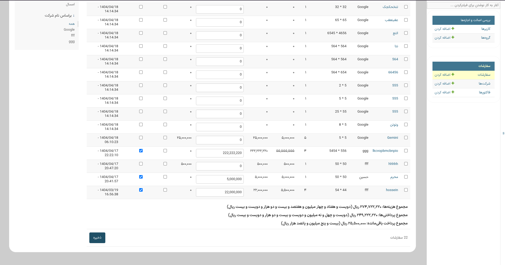
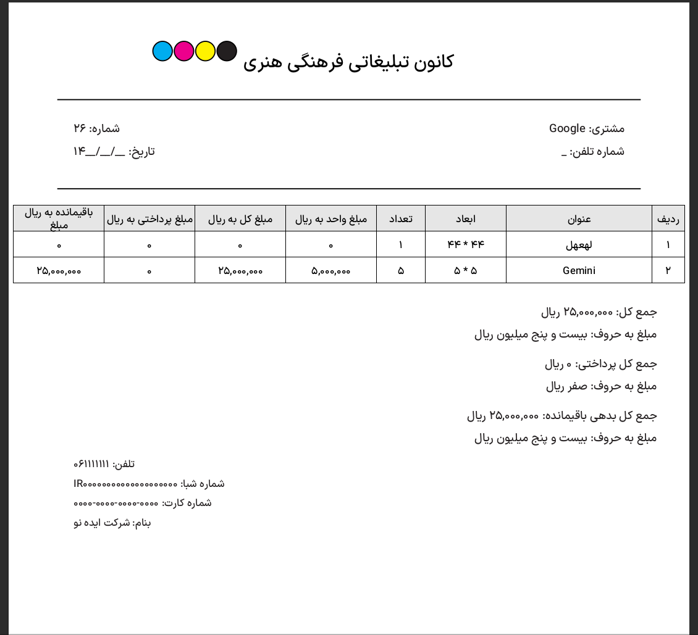

# سیستم مدیریت سفارشات چاپخانه (Order Management System)

این پروژه یک نرم‌افزار تحت ویندوز برای مدیریت سفارشات چاپخانه است که با استفاده از فریم‌ورک Django توسعه داده شده است. هدف اصلی این نرم‌افزار، ساده‌سازی فرآیند ثبت و پیگیری سفارشات برای کارکنان، طراحان و مدیران چاپخانه است.

This project is a desktop-like application for printing houses to manage their orders. It's built with the Django framework and packaged to run on Windows locally.

---

## Features

- **ثبت سفارشات با جزئیات کامل:** امکان ثبت سفارش‌های جدید همراه با تمام جزئیات مورد نیاز.
- **مدیریت سفارشات شرکتی:** اتصال سفارشات به شرکت‌ها و مدیریت متمرکز آن‌ها.
- **صدور فاکتور خودکار:** قابلیت ساخت و چاپ فاکتور برای هر سفارش به صورت جداگانه.
- **جستجو و فیلتر پیشرفته:** امکان جستجو و فیلتر کردن سفارشات بر اساس نام، تاریخ، قیمت و سایر پارامترها.
- **رابط کاربری ساده:** استفاده از پنل ادمین جنگو که یک رابط کاربری آشنا و قدرتمند برای مدیریت داده‌ها فراهم می‌کند.
- **نصب و اجرای آسان:** بدون نیاز به نصب پایتون یا تنظیمات پیچیده؛ تنها با یک کلیک اجرا می‌شود.

---

## Tech Stack

-   **Backend:** Django
-   **Database:** SQLite
-   **Web Server:** Waitress
-   **Packaging:** Embedded Python, VBScript, and Batch Scripts for Windows environment.

---

## Screenshots

### لیست سفارشات:

### نمونه فاکتور:

